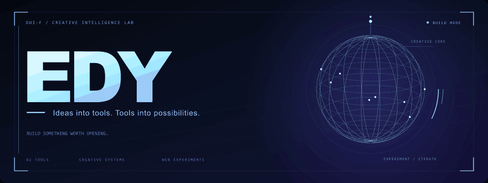

<p align="center">
  
</p>

<p align="center">
  
</p>

<p align="center">
  <strong>AI tools · Creative workflows · Web experiments</strong><br />
  把想法做成工具，把工具带进真实创作。
</p>

<p align="center">
  <a href="https://github.com/Dui-F?tab=repositories">Explore my repositories ↗</a>
  &nbsp; / &nbsp;
  <a href="https://github.com/Dui-F/neighbor-novelist">Meet 对门小说家 ↗</a>
</p>

---

### `01 / whoami`

Hi, I'm **EDY** — `Dui-F` on GitHub.

这里放着我做的 AI 创作工具、提示词实验和网页作品。从小说与剧本，到结构化图像提示词，再到交互式网页：让创意有一个可以打开的入口。

```text
edy@workbench ~ $ ls interests/
ai-creation/    storytelling/    prompt-design/    web-experiments/
```

### `02 / selected builds`

| Project | What lives inside |
| :--- | :--- |
| **[对门小说家](https://github.com/Dui-F/neighbor-novelist)** | 本地优先的 AI 小说与剧本创作工作台。 |
| **[Candid Snapshot Prompt](https://github.com/Dui-F/candid-snapshot-prompt)** | 22 段式手机快照提示词模板，探索照片的生活感、偶然感和不完美感。 |
| **[Luna 3D Resume](https://github.com/Dui-F/luna-3d-resume)** | TypeScript 项目 · 3D 简历方向的网页实验。 |
| **[PromptGrab](https://github.com/Dui-F/promptgrab-site)** | PromptGrab 的公开网站。 |

### `03 / code palette`

公开原创项目里的语言：**TypeScript · JavaScript · HTML · CSS**

### `04 / contribution arcade`

<picture>
  <source media="(prefers-color-scheme: dark)" srcset="./assets/github-snake-dark.svg" />
  <source media="(prefers-color-scheme: light)" srcset="./assets/github-snake.svg" />
  
</picture>

<sub>贡献图快照：2026-10-09 · Animation powered by <a href="https://github.com/Platane/snk">snk</a>.</sub>

### `05 / explore`

想看实现，直接进仓库。想了解创作工作台，从 **[对门小说家](https://github.com/Dui-F/neighbor-novelist)** 开始。

<p align="right"><sub>Built with curiosity. Shipped one experiment at a time.</sub></p>

<!-- Typing animation generated with https://github.com/DenverCoder1/readme-typing-svg. -->
